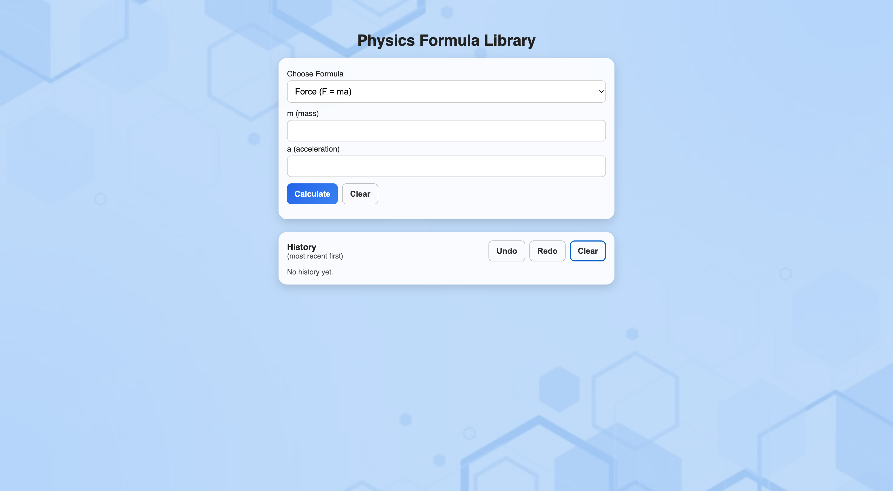
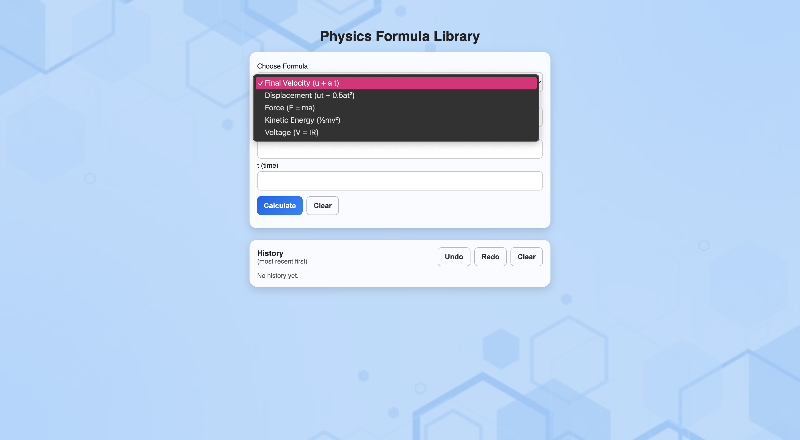

# 📚 Physics Formula Library

A clean and responsive **Physics Formula Library** built using **HTML, CSS, and JavaScript**. This project helps students quickly access important physics formulas through a simple, organized, and user-friendly interface.

---

## 🌟 Features

- 📖 Well-organized collection of physics formulas
- 🔍 Simple and easy-to-use interface
- 💻 Responsive design for desktop and mobile devices
- ⚡ Lightweight and fast
- 🎨 Clean and modern UI

---

## 🛠️ Tech Stack

- HTML5
- CSS3
- JavaScript

---

## 📸 Screenshots

### 🏠 Home Page



### 📖 Formula Page



---

## 📂 Project Structure

```text
Physics-Formula-Library/
│── assets/
│   └── screenshots/
│       ├── home.png
│       └── formula.png
│── index.html
│── style.css
│── script.js
│── README.md
```

---

## 🚀 Getting Started

1. Clone this repository:

```bash
git clone https://github.com/priyanshisingh0210/Physics-Formula-Library.git
```

2. Open the project folder.

3. Open `index.html` in your preferred web browser.

---

## 🎯 Project Objective

The aim of this project is to provide students with a simple and accessible platform to quickly view commonly used physics formulas for learning and revision.

---

## 📈 Future Improvements

- 🔎 Search functionality for formulas
- 📂 Categorization by physics topics
- 🌙 Dark mode support
- ❤️ Favorite/bookmark formulas
- 📱 Progressive Web App (PWA) support

---

## 👩‍💻 Author

**Priyanshi Singh**

- GitHub: https://github.com/priyanshisingh0210
- LinkedIn: https://www.linkedin.com/in/priyanshi-singh-8b4158313

---

## ⭐ Show Your Support

If you found this project helpful, please consider giving it a ⭐ on GitHub. It helps support the project and encourages further improvements.